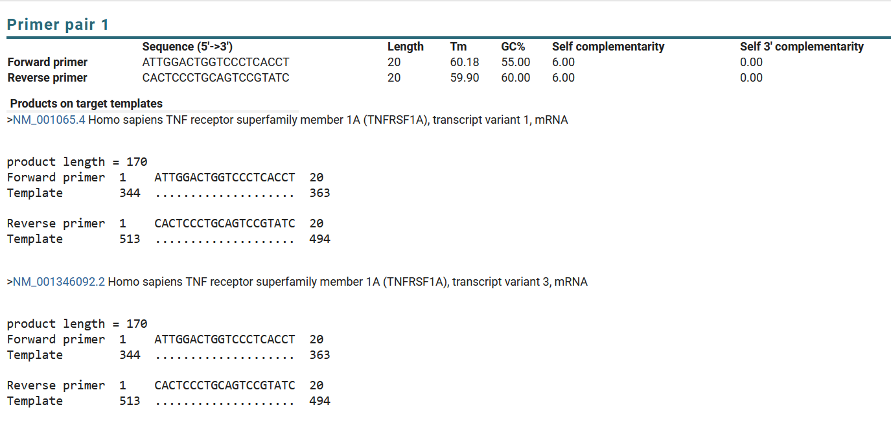
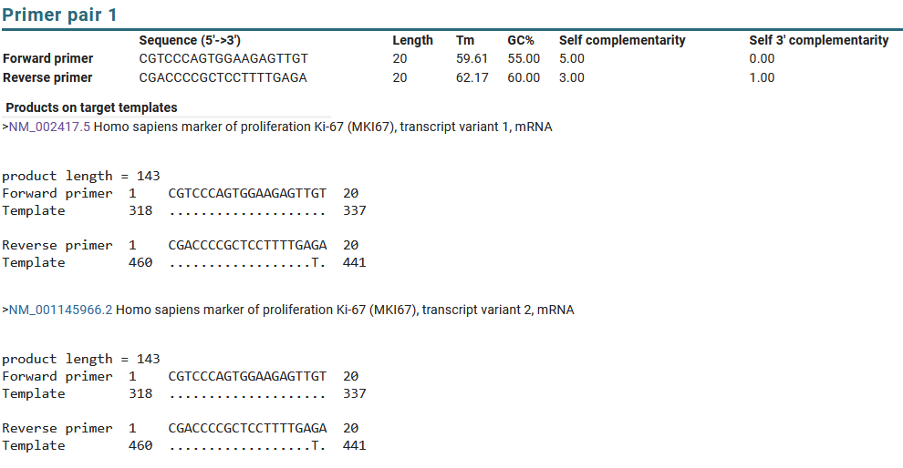
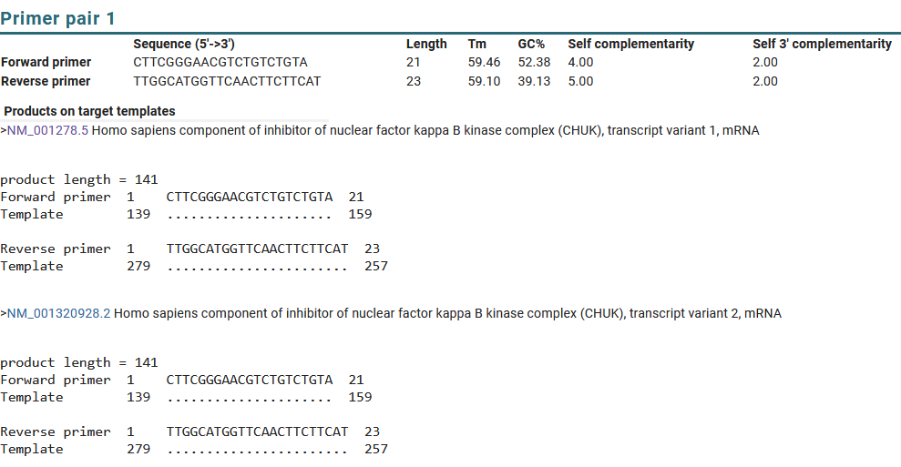

# Introduction
This README contains information on primers related to 
NF-kB pathways.

Commercial kits for NF-kB signaling pathway: [link](https://sciencellonline.com/en/genequerytm-human-nf-kb-signaling-pathway-qpcr-array-kit/?srsltid=AfmBOoqiMr_BTlStEJi1FU-a4pD_cTIy_BmhSFPtJ849m8Z7phvT0Ilj)

One paper on neuroblastoma cell line with cisplatin: [link](https://www.hamidiyemedj.com/articles/evaluation-of-ikk-b-nf-kb-p53-and-ki-67-protein-and-gene-expression-in-neuroblastoma-cells-treated-with-cisplatin/doi/hamidiyemedj.galenos.2024.82905)

Selected genes:
- Receptors: TNFRSF1A, IL1R1
- Cytokines: TNF(TNF-a), IL1B, IL10
- Transcription factors: MKI67
- Structural genes: NFKB1
- Inhibitors: IKK1
- Apoptosis: TP53 
  

# Human primers
## Receptors: TNSFRSF1A, IL1R1
- TNFRSF1A:
    - From this [paper](https://www.spandidos-publications.com/10.3892/ol.2024.14559?text=fulltext)
    - Forward: 5'-ATTGGACTGGTCCCTCACCT-3'
    - Reverse: 5'-CACTCCCTGCAGTCCGTATC-3'
    - Primer Blast result:  
    - Product length: 170 bp
- IL1R1
    - From origene [link](https://www.origene.com/catalog/gene-expression/qpcr-primer-pairs/hp200817-il1-receptor-i-il1r1-human-qpcr-primer-pair-nm-000877)
    - Forward: 5'-GTGCTTTGGTACAGGGATTCCTG-3'
    - Reverse: 5'-CACAGTCAGAGGTAGACCCTTC-3'
    - Primer Blast result:  
    - Product length: 121 bp

## Cytokines: TNF, IL1B, IL6 and IL10
- TNF: 
  - From [Origene](https://www.origene.com/catalog/gene-expression/qpcr-primer-pairs/hp200561-tnf-alpha-tnf-human-qpcr-primer-pair-nm-000594)
  - Forward: 5'-CCCGAGTGACAAGCCTGTAG-3'
  - Reverse: 5'-ATGGGCTACAGGCTTGTCACTC-3'
  - Primer Blast result: 
  - Product length: 135 bp
- IL1B:
  - From this [paper](https://www.nature.com/articles/s41598-021-92941-2) table S1.
  - Forward: 5'-AAATACCTGTGGCCTTGGGC-3'
  - Reverse: 5'-TTTGGGATCTACACTCTCCAGCT-3'
  - Primer Blast result: 
  - Product length: 101 bp
- IL6:
  - From this [paper](https://www.nature.com/articles/s41598-021-92941-2) table S1.
  - Forward: 5'-GTAGCCGCCCCACACAGA-3'
  - Reverse: 5'-CATGTCTCCTTTCTCAGGGCTG-3'
  - Primer Blast result: 
  - Product length: 101 bp
- IL10:
  - From this [paper](https://www.nature.com/articles/s41598-021-92941-2) table S1.
  - Forward: 5'-TCATCGATTTCTTCCCTGTG-3'
  - Reverse: 5'-ATGGCTTTGTAGATGCCTTT-3'
  - Primer Blast result: 
  - Product length: 96 bp

## Transcription factors: MKI67
- MKI67
  - From this paper [link](https://www.nature.com/articles/s41418-021-00823-x#Sec1). This paper investigates Ki67 protein in terms of DNA damage and p53 tumor repressor.
  - Forward: 5'-CGTCCCAGTGGAAGAGTTGT-3'
  - Reverse: 5'-CGACCCCGCTCCTTTTGAGA-3'
  - Primer Blast result: 
  - Product length: 143 bp

## Structural genes: NFKB1
- NFKB1
  - From this paper on diabetes [link](https://pmc.ncbi.nlm.nih.gov/articles/PMC8761634/#T1)
  - Forward:5'-AACAGAGAGGATTTCGTTTCCG-3'
  - Reverse:5'-	TTTGACCTGAGGGTAAGACTTCT-3'
  - Primer Blast result: 
  - Product length: 104 bp

## Activators: IKK1
IKK1 (CHUK) protein phosphorylates IkBa protein, and then IkBa is degraded by proteasome, releasing NF-kB to the nucleus. Thus IKK1 is an indirect activator of NF-kB.
- IKK1
  - From this [paper](https://www.sciencedirect.com/science/article/pii/S0167488918300600#s0035) 
  - Forward: 5'-CTTCGGGAACGTCTGTCTGTA-3'
  - Reverse: 5'-TTGGCATGGTTCAACTTCTTCAT-3'
  - Primer Blast reesult: 
  - Product length: 141 bp

## Apoptosis: TP53
- TP53
  - From this paper on p53 effects[link](https://pmc.ncbi.nlm.nih.gov/articles/PMC10735018/)
  - Forward: 5'-GAGCTGAATGAGGCCTTGGA-3'
  - Reverse: 5'-CTGAGTCAGGCCCTTCTGTCTT-3'
  - Primer Blast result: 
  - Product length: 151 bp