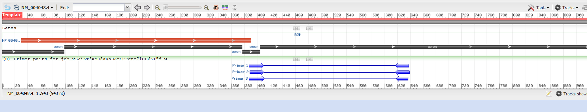
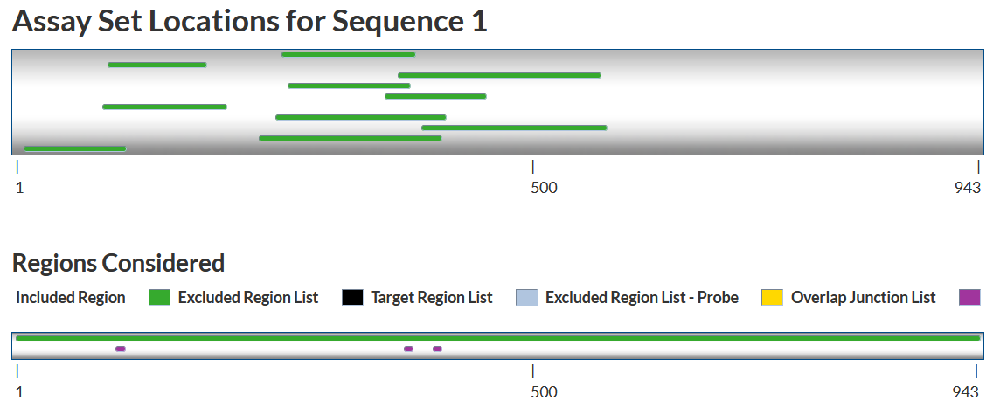

qPCR primer and probe design for B2M.
This is based on GRCh38.p14.

# Introduction
B2M is a housekeeping gene that is expressed in kidney tissue. Literature can be found here [link](https://www.sciencedirect.com/science/article/pii/S0065128121001434). It is on chromosome 15.

# Primer probe design
## 1.
Search on NCBI for B2M gene accession: [result](https://www.ncbi.nlm.nih.gov/nuccore/1390142000). The accession number is NG_012920.2. Search for the transcripts: NM_004048.4.
Then we can run Primer Blast first to locate the region that is specific for putting into IDT Primer Quest. Use the default setup is fine.
## 2.
From the result, we can see that exon 3 and 4 were used.

## 3. 
Download exon sequences. Go to B2M [Refseq entry](https://www.ncbi.nlm.nih.gov/gene/567/). In the graphic view, put the cursor on the transcript NM_004048.4, and click under "Donwload FASTA:"
- NM_004048.4.
```
>ref|NM_004048.4|:1-943 Homo sapiens beta-2-microglobulin (B2M), mRNA
ATTCCTGAAGCTGACAGCATTCGGGCCGAGATGTCTCGCTCCGTGGCCTTAGCTGTGCTCGCGCTACTCT
CTCTTTCTGGCCTGGAGGCTATCCAGCGTACTCCAAAGATTCAGGTTTACTCACGTCATCCAGCAGAGAA
TGGAAAGTCAAATTTCCTGAATTGCTATGTGTCTGGGTTTCATCCATCCGACATTGAAGTTGACTTACTG
AAGAATGGAGAGAGAATTGAAAAAGTGGAGCATTCAGACTTGTCTTTCAGCAAGGACTGGTCTTTCTATC
TCTTGTACTACACTGAATTCACCCCCACTGAAAAAGATGAGTATGCCTGCCGTGTGAACCATGTGACTTT
GTCACAGCCCAAGATAGTTAAGTGGGATCGAGACATGTAAGCAGCATCATGGAGGTTTGAAGATGCCGCA
TTTGGATTGGATGAATTCCAAATTCTGCTTGCTTGCTTTTTAATATTGATATGCTTATACACTTACACTT
TATGCACAAAATGTAGGGTTATAATAATGTTAACATGGACATGATCTTCTTTATAATTCTACTTTGAGTG
CTGTCTCCATGTTTGATGTATCTGAGCAGGTTGCTCCACAGGTAGCTCTAGGAGGGCTGGCAACTTAGAG
GTGGGGAGCAGAGAATTCTCTTATCCAACATCAACATCTTGGTCAGATTTGAACTCTTCAATCTCTTGCA
CTCAAAGCTTGTTAAGATAGTTAAGCGTGCATAAGTTAACTTCCAATTTACATACTCTGCTTAGAATTTG
GGGGAAAATTTAGAAATATAATTGACAGGATTATTGGAAATTTGTTATAATGAATGAAACATTTTGTCAT
ATAAGATTCATATTTACTTCTTATACATTTGATAAAGTAAGGCATGGTTGTGGTTAATCTGGTTTATTTT
TGTTCCACAAGTTAAATAAATCATAAAACTTGA
```
  
- NM_004048.4 exons. (or you can find this information on the website of this transcript)
``` 
>ref|NM_004048.4|:1-97 Homo sapiens beta-2-microglobulin (B2M), mRNA
ATTCCTGAAGCTGACAGCATTCGGGCCGAGATGTCTCGCTCCGTGGCCTTAGCTGTGCTCGCGCTACTCT
CTCTTTCTGGCCTGGAGGCTATCCAGC
>ref|NM_004048.4|:98-376 Homo sapiens beta-2-microglobulin (B2M), mRNA
GTACTCCAAAGATTCAGGTTTACTCACGTCATCCAGCAGAGAATGGAAAGTCAAATTTCCTGAATTGCTA
TGTGTCTGGGTTTCATCCATCCGACATTGAAGTTGACTTACTGAAGAATGGAGAGAGAATTGAAAAAGTG
GAGCATTCAGACTTGTCTTTCAGCAAGGACTGGTCTTTCTATCTCTTGTACTACACTGAATTCACCCCCA
CTGAAAAAGATGAGTATGCCTGCCGTGTGAACCATGTGACTTTGTCACAGCCCAAGATAGTTAAGTGGG
>ref|NM_004048.4|:377-404 Homo sapiens beta-2-microglobulin (B2M), mRNA
ATCGAGACATGTAAGCAGCATCATGGAG
>ref|NM_004048.4|:405-943 Homo sapiens beta-2-microglobulin (B2M), mRNA
GTTTGAAGATGCCGCATTTGGATTGGATGAATTCCAAATTCTGCTTGCTTGCTTTTTAATATTGATATGC
TTATACACTTACACTTTATGCACAAAATGTAGGGTTATAATAATGTTAACATGGACATGATCTTCTTTAT
AATTCTACTTTGAGTGCTGTCTCCATGTTTGATGTATCTGAGCAGGTTGCTCCACAGGTAGCTCTAGGAG
GGCTGGCAACTTAGAGGTGGGGAGCAGAGAATTCTCTTATCCAACATCAACATCTTGGTCAGATTTGAAC
TCTTCAATCTCTTGCACTCAAAGCTTGTTAAGATAGTTAAGCGTGCATAAGTTAACTTCCAATTTACATA
CTCTGCTTAGAATTTGGGGGAAAATTTAGAAATATAATTGACAGGATTATTGGAAATTTGTTATAATGAA
TGAAACATTTTGTCATATAAGATTCATATTTACTTCTTATACATTTGATAAAGTAAGGCATGGTTGTGGT
TAATCTGGTTTATTTTTGTTCCACAAGTTAAATAAATCATAAAACTTGA 
```
The top one will be used as a whole mRNA sequence, whereas the exons one will be used for specifying the exon/exon junctions.
## 4. 
Open IDT primer quest, fill in the mRNA sequence. Under Custom Design Parameters, set design parameters for qPCR (2 Primers + Probe). Then change the parameters:
- Primer GC %: 40-60. Opt = 50
- Probe GC %: 30-80. Opt = 50
- Amplicon size: 75-200. Opt = 120
- Overlap Junction List: 97,376,404 (fill in positions according to exons)

## 5.
Click "GET ASSAYS" and we can see the results. Click **SHOW CUSTOM TARGET REGIONS** and we can see the primer overlap with the junctions:

Click "DOWNLOAD ASSAYS" and we can examine the primer-probe sets.

## 6. 
Examine the primer-probe sets. Pick one that looks ok and check the specificity using Primer-BLAST: 
- Fill in the "Primer Parameters". Paste the forward and reverse primers into "Use my own forward primer (5'->3' on plus strand)" and "Use my own reverse primer (5'->3' on minus strand)", respectively. 
- Select core_nt as the database. 
- Check "Exclude predicted Refseq transcripts (accession with XM, XR prefix)" and "Exclude uncultured/environmental sample sequences"
- Select "homo sapiens" as organism. 
- Check "show results in a new window" and "use new graphic view"

## 7.
Verify that all the amplified templates are B2M mRNAs using Primer Blast. Check self complementarity is less or equal to 5.
Now we have:
- Forward primer: 5'-GTCTTTCAGCAAGGACTGGT-3'
- Reverse primer: 5'-CGGCATCTTCAAACCTCCA-3'
- Probe: 5'-AGATGAGTATGCCTGCCGTGTGAA-3'