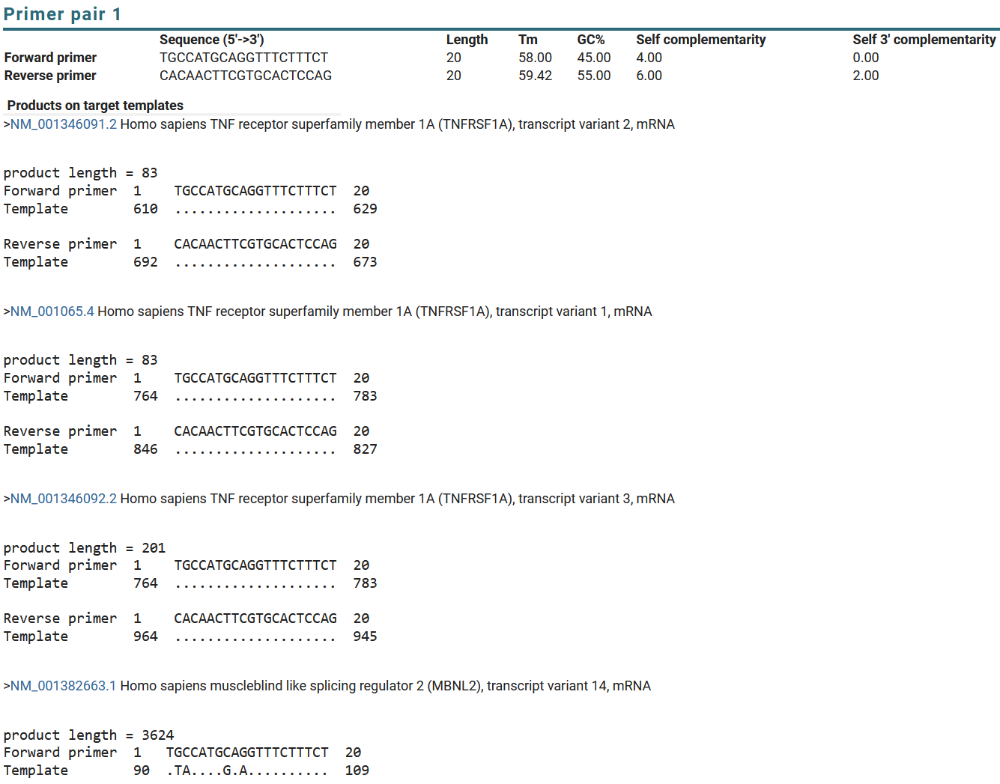
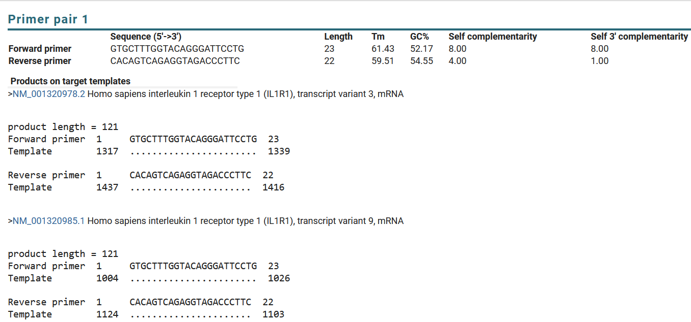
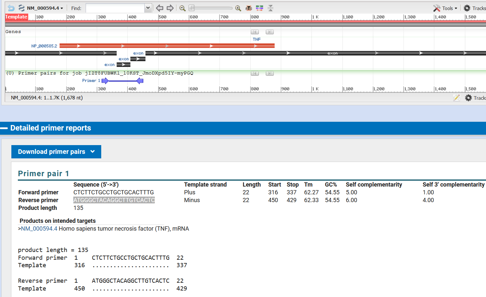
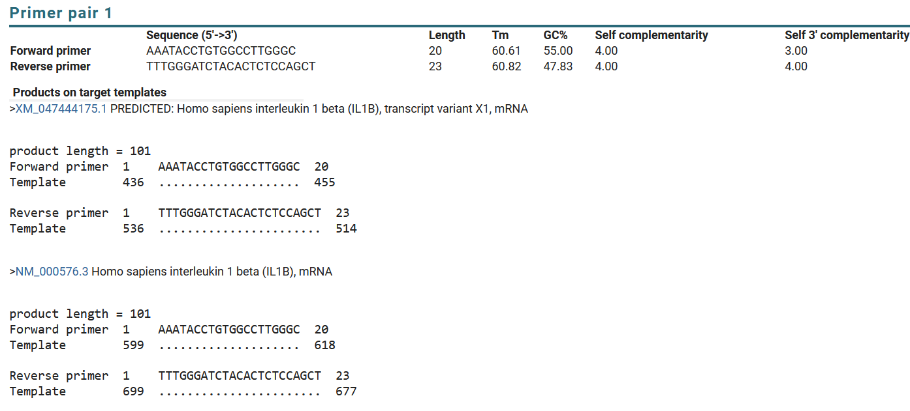
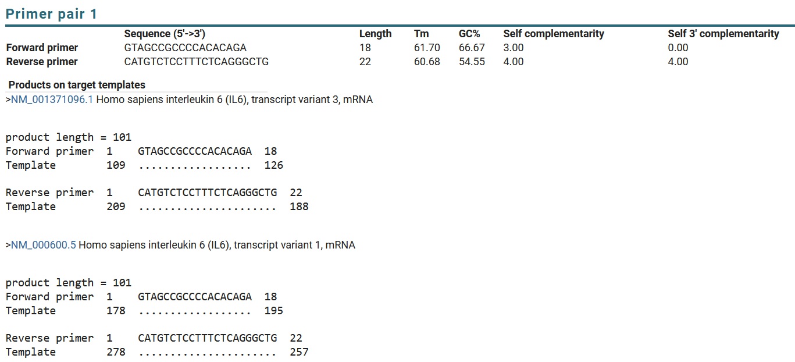
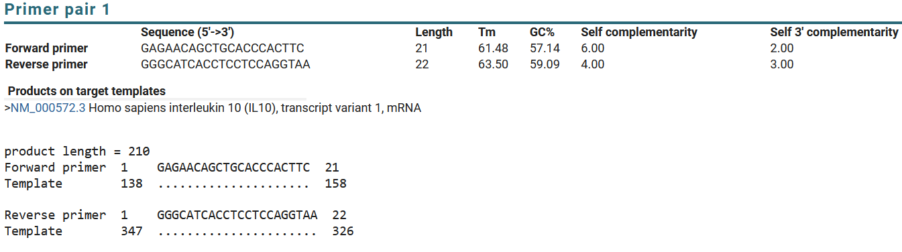
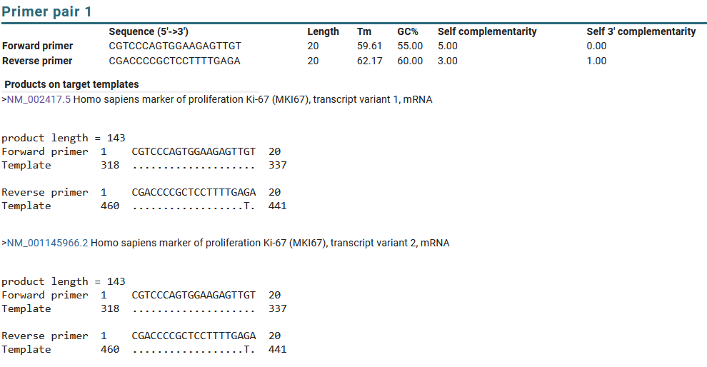
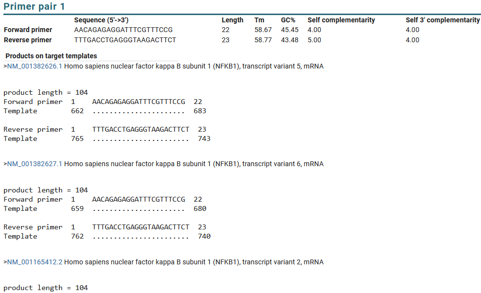
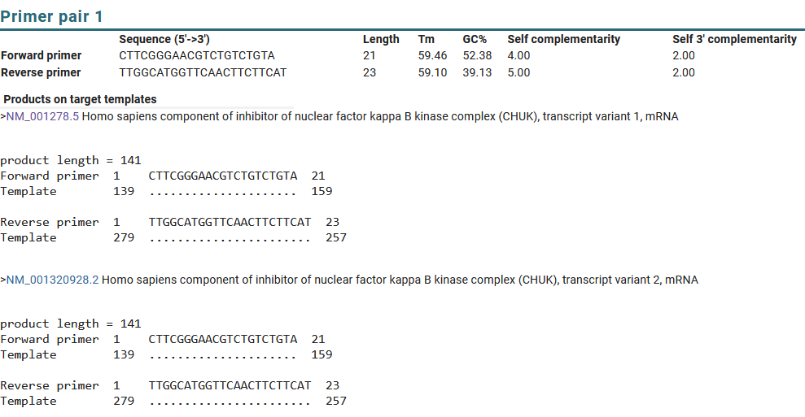
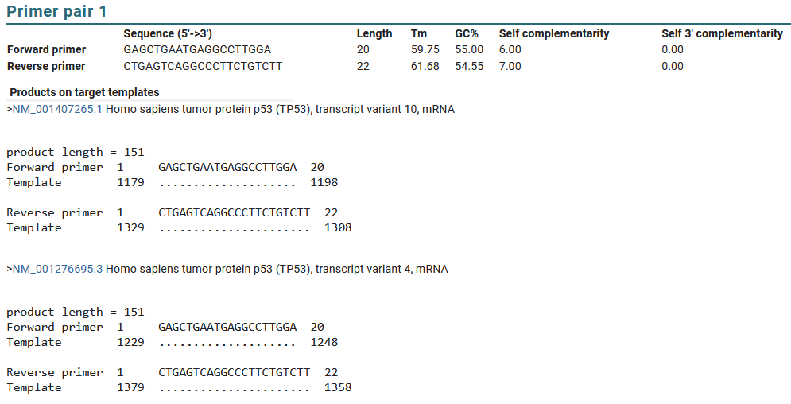

# Introduction
This README contains information on primers related to 
NF-kB pathways.

Commercial kits for NF-kB signaling pathway: [link](https://sciencellonline.com/en/genequerytm-human-nf-kb-signaling-pathway-qpcr-array-kit/?srsltid=AfmBOoqiMr_BTlStEJi1FU-a4pD_cTIy_BmhSFPtJ849m8Z7phvT0Ilj)

One paper on neuroblastoma cell line with cisplatin: [link](https://www.hamidiyemedj.com/articles/evaluation-of-ikk-b-nf-kb-p53-and-ki-67-protein-and-gene-expression-in-neuroblastoma-cells-treated-with-cisplatin/doi/hamidiyemedj.galenos.2024.82905)

Selected genes:
- Receptors: TNFRSF1A, IL1R1, TNFRSF12A
- Cytokines: TNF(TNF-a), IL1B, IL6, IL10
- Transcription factors: MKI67, ATF3, JUN, JUND, FOSL2
- Structural genes: NFKB1, NFKB2
- Inhibitors: IKK1, CDKN1A
- Apoptosis: TP53 
- Tropomyosin: TPM4
- Phosphatase: DUSP1

# Design Principles
Generally all primers from papers are validated using Primer Blast. When I design the primers, I usually use Primer Blast, and follow the below principles:
- For genes with multiple isoforms, I try to limit the forward and reverse primers to fall within the protein coding region (CDS) or common region of the isoforms. The range can be found by clicking into "Fastq" record of a transcript in NCBI, and then clicking into "Graphics".
- PCR product size: 100-200 bp.
- Primer melting temperature (Tm): 58-62 °C. Max Tm difference: 1 °C.
- \# of primers to return: set so that we can select primers that are either spanning exon-exon junctions or separated by introns.
- Search in the Refseq mRNA of the species we are designing primers for. Exclude uncultured/environmental sample sequences.
- Primer size: 16-24. Opt 20
- Primer GC content: 40-60%
- Max self complementarity: 5
- Max self 3' complementarity: 5

# Human primers
## Receptors: 
- TNFRSF1A:
    - From this [paper](https://www.sciencedirect.com/science/article/pii/S1476558618300113#ec0005)
    - Forward: 5'-TGCCATGCAGGTTTCTTTCT-3'
    - Reverse: 5'-CACAACTTCGTGCACTCCAG-3'
    - Primer Blast result:  
- IL1R1
    - From origene [link](https://www.origene.com/catalog/gene-expression/qpcr-primer-pairs/hp200817-il1-receptor-i-il1r1-human-qpcr-primer-pair-nm-000877)
    - Forward: 5'-GTGCTTTGGTACAGGGATTCCTG-3'
    - Reverse: 5'-CACAGTCAGAGGTAGACCCTTC-3'
    - Primer Blast result:  
    - Product length: 121 bp
- TNFRSF12A
  - Forward: 5'-TGCTTTGGCCCATCCTTGG-3'
  - Reverse: 5'-GTCTCCTCTATGGGGGTGGT-3'
  - Product Length: 121 bp

## Cytokines:
- TNF: 
  - From [Origene](https://www.origene.com/catalog/gene-expression/qpcr-primer-pairs/hp200561-tnf-alpha-tnf-human-qpcr-primer-pair-nm-000594)
  - Forward: 5'-CTCTTCTGCCTGCTGCACTTTG-3'
  - Reverse: 5'-ATGGGCTACAGGCTTGTCACTC-3'
  - Primer Blast result: 
  - Product length: 135 bp
- IL1B:
  - From this [paper](https://www.nature.com/articles/s41598-021-92941-2) table S1.
  - Forward: 5'-AAATACCTGTGGCCTTGGGC-3'
  - Reverse: 5'-TTTGGGATCTACACTCTCCAGCT-3'
  - Primer Blast result: 
  - Product length: 101 bp
- IL6:
  - From this [paper](https://www.nature.com/articles/s41598-021-92941-2) table S1.
  - Forward: 5'-GTAGCCGCCCCACACAGA-3'
  - Reverse: 5'-CATGTCTCCTTTCTCAGGGCTG-3'
  - Primer Blast result: 
  - Product length: 101 bp
- IL10:
  - From this [paper](https://www.nature.com/articles/s41598-024-64097-2#Sec11). Sequence from Applied Biosystems.
  - Forward: 5'-GAGAACAGCTGCACCCACTTC-3'
  - Reverse: 5'-GGGCATCACCTCCTCCAGGTAA-3'
  - Primer Blast result: 
  - Product length: 96 bp

## Transcription factors:
- MKI67
  - From this paper [link](https://www.nature.com/articles/s41418-021-00823-x#Sec1). This paper investigates Ki67 protein in terms of DNA damage and p53 tumor repressor.
  - Forward: 5'-CGTCCCAGTGGAAGAGTTGT-3'
  - Reverse: 5'-CGACCCCGCTCCTTTTGAGA-3'
  - Primer Blast result: 
  - Product length: 143 bp
- ATF3
  - Forward: 5'-CTCGGGGTGTCCATCACAAA-3'
  - Reverse: 5'-AGCTTCTCCGACTCTTTCTGC-3'
  - Primer Blast result:
    ```
        Primer pair 1
      Sequence (5'->3')	Template strand	Length	Start	Stop	Tm	GC%	Self complementarity	Self 3' complementarity
    Forward primer	CTCGGGGTGTCCATCACAAA	Plus	20	388	407	59.96	55.00	3.00	0.00
    Reverse primer	AGCTTCTCCGACTCTTTCTGC	Minus	21	536	516	60.07	52.38	4.00	2.00
    Product length	149
    Products on intended targets
    >XM_054336744.1 PREDICTED: Homo sapiens activating transcription factor 3 (ATF3), transcript variant X2, mRNA


    product length = 149
    Forward primer  1    CTCGGGGTGTCCATCACAAA  20
    Template        404  ....................  423

    Reverse primer  1    AGCTTCTCCGACTCTTTCTGC  21
    Template        552  .....................  532

    >XM_011509579.2 PREDICTED: Homo sapiens activating transcription factor 3 (ATF3), transcript variant X2, mRNA


    product length = 149
    Forward primer  1    CTCGGGGTGTCCATCACAAA  20
    Template        363  ....................  382

    Reverse primer  1    AGCTTCTCCGACTCTTTCTGC  21
    Template        511  .....................  491

    >XM_005273146.2 PREDICTED: Homo sapiens activating transcription factor 3 (ATF3), transcript variant X1, mRNA


    product length = 149
    Forward primer  1    CTCGGGGTGTCCATCACAAA  20
    Template        729  ....................  748

    Reverse primer  1    AGCTTCTCCGACTCTTTCTGC  21
    Template        877  .....................  857

    >NM_001030287.4 Homo sapiens activating transcription factor 3 (ATF3), transcript variant 3, mRNA


    product length = 149
    Forward primer  1    CTCGGGGTGTCCATCACAAA  20
    Template        295  ....................  314

    Reverse primer  1    AGCTTCTCCGACTCTTTCTGC  21
    Template        443  .....................  423

    >XM_054336743.1 PREDICTED: Homo sapiens activating transcription factor 3 (ATF3), transcript variant X1, mRNA


    product length = 149
    Forward primer  1    CTCGGGGTGTCCATCACAAA  20
    Template        847  ....................  866

    Reverse primer  1    AGCTTCTCCGACTCTTTCTGC  21
    Template        995  .....................  975

    >NM_001674.4 Homo sapiens activating transcription factor 3 (ATF3), transcript variant 1, mRNA


    product length = 149
    Forward primer  1    CTCGGGGTGTCCATCACAAA  20
    Template        388  ....................  407

    Reverse primer  1    AGCTTCTCCGACTCTTTCTGC  21
    Template        536  .....................  516

    >NM_001206488.3 Homo sapiens activating transcription factor 3 (ATF3), transcript variant 8, mRNA


    product length = 149
    Forward primer  1    CTCGGGGTGTCCATCACAAA  20
    Template        365  ....................  384

    Reverse primer  1    AGCTTCTCCGACTCTTTCTGC  21
    Template        513  .....................  493

    >NM_001206484.3 Homo sapiens activating transcription factor 3 (ATF3), transcript variant 5, mRNA


    product length = 149
    Forward primer  1    CTCGGGGTGTCCATCACAAA  20
    Template        348  ....................  367

    Reverse primer  1    AGCTTCTCCGACTCTTTCTGC  21
    Template        496  .....................  476
    ```
  - Product length: 149 bp
- JUN:
  - Forward: 5'-CCGGCTGGAGGAAAAAGTGA-3'
  - Reverse: 5'-TTAGCATGAGTTGGCACCCA-3'
  - Primer Blast result:
    ```
        Primer pair 11
      Sequence (5'->3')	Template strand	Length	Start	Stop	Tm	GC%	Self complementarity	Self 3' complementarity
    Forward primer	CCGGCTGGAGGAAAAAGTGA	Plus	20	1811	1830	60.25	55.00	4.00	1.00
    Reverse primer	TTAGCATGAGTTGGCACCCA	Minus	20	1950	1931	59.60	50.00	4.00	3.00
    Product length	140
    Products on intended targets
    >NM_002228.4 Homo sapiens Jun proto-oncogene, AP-1 transcription factor subunit (JUN), mRNA


    product length = 140
    Forward primer  1     CCGGCTGGAGGAAAAAGTGA  20
    Template        1811  ....................  1830

    Reverse primer  1     TTAGCATGAGTTGGCACCCA  20
    Template        1950  ....................  1931
    ```
- JUND
  - Forward: 5'-ATCATCCAGTCCAACGGGC-3'
  - Reverse: 5'-GGTTCTGCTTGTGTAAATCCTCC-3'
  - Primer Blast result:
    ```
        Primer pair 8
      Sequence (5'->3')	Template strand	Length	Start	Stop	Tm	GC%	Self complementarity	Self 3' complementarity
    Forward primer	ATCATCCAGTCCAACGGGC	Plus	19	457	475	59.78	57.89	3.00	2.00
    Reverse primer	GGTTCTGCTTGTGTAAATCCTCC	Minus	23	592	570	59.56	47.83	2.00	0.00
    Product length	136
    Products on intended targets
    >NM_005354.6 Homo sapiens JunD proto-oncogene, AP-1 transcription factor subunit (JUND), transcript variant 1, mRNA


    product length = 136
    Forward primer  1    ATCATCCAGTCCAACGGGC  19
    Template        457  ...................  475

    Reverse primer  1    GGTTCTGCTTGTGTAAATCCTCC  23
    Template        592  .......................  570
    ```
- FOSL2
  - Forward: 5'-TGTGCAAGATTAGCCCCGAG-3'
  - Reverse: 5'-TGTTTCACCACTACAGCGCC-3'
  - Product length: 100 bp
  - Primer Blast result: 
    ```
    Primer pair 2
    Sequence (5'->3')	Template strand	Length	Start	Stop	Tm	GC%	Self complementarity	Self 3' complementarity
    Forward primer	TGTGCAAGATTAGCCCCGAG	Plus	20	1432	1451	60.11	55.00	4.00	2.00
    Reverse primer	TGTTTCACCACTACAGCGCC	Minus	20	1531	1512	60.88	55.00	4.00	2.00
    Product length	100
    Products on intended targets
    >XM_054341223.1 PREDICTED: Homo sapiens FOS like 2, AP-1 transcription factor subunit (FOSL2), transcript variant X3, mRNA


    product length = 100
    Forward primer  1     TGTGCAAGATTAGCCCCGAG  20
    Template        1535  ....................  1554

    Reverse primer  1     TGTTTCACCACTACAGCGCC  20
    Template        1634  ....................  1615

    >XM_054341222.1 PREDICTED: Homo sapiens FOS like 2, AP-1 transcription factor subunit (FOSL2), transcript variant X4, mRNA


    product length = 100
    Forward primer  1     TGTGCAAGATTAGCCCCGAG  20
    Template        2438  ....................  2457

    Reverse primer  1     TGTTTCACCACTACAGCGCC  20
    Template        2537  ....................  2518

    >XM_005264231.5 PREDICTED: Homo sapiens FOS like 2, AP-1 transcription factor subunit (FOSL2), transcript variant X3, mRNA


    product length = 100
    Forward primer  1     TGTGCAAGATTAGCCCCGAG  20
    Template        1535  ....................  1554

    Reverse primer  1     TGTTTCACCACTACAGCGCC  20
    Template        1634  ....................  1615

    >XM_006711977.4 PREDICTED: Homo sapiens FOS like 2, AP-1 transcription factor subunit (FOSL2), transcript variant X2, mRNA


    product length = 100
    Forward primer  1    TGTGCAAGATTAGCCCCGAG  20
    Template        569  ....................  588

    Reverse primer  1    TGTTTCACCACTACAGCGCC  20
    Template        668  ....................  649

    >NM_005253.4 Homo sapiens FOS like 2, AP-1 transcription factor subunit (FOSL2), mRNA


    product length = 100
    Forward primer  1     TGTGCAAGATTAGCCCCGAG  20
    Template        1432  ....................  1451

    Reverse primer  1     TGTTTCACCACTACAGCGCC  20
    Template        1531  ....................  1512

    >XM_006711976.4 PREDICTED: Homo sapiens FOS like 2, AP-1 transcription factor subunit (FOSL2), transcript variant X1, mRNA


    product length = 100
    Forward primer  1     TGTGCAAGATTAGCCCCGAG  20
    Template        1483  ....................  1502

    Reverse primer  1     TGTTTCACCACTACAGCGCC  20
    Template        1582  ....................  1563

    >XM_054341221.1 PREDICTED: Homo sapiens FOS like 2, AP-1 transcription factor subunit (FOSL2), transcript variant X1, mRNA


    product length = 100
    Forward primer  1     TGTGCAAGATTAGCCCCGAG  20
    Template        1483  ....................  1502

    Reverse primer  1     TGTTTCACCACTACAGCGCC  20
    Template        1582  ....................  1563
    ```

## Structural genes: NFKB1
- NFKB1
  - From this paper on diabetes [link](https://pmc.ncbi.nlm.nih.gov/articles/PMC8761634/#T1)
  - Forward:5'-AACAGAGAGGATTTCGTTTCCG-3'
  - Reverse:5'-	TTTGACCTGAGGGTAAGACTTCT-3'
  - Primer Blast result: 
  - Product length: 104 bp

## Structural genes: NFKB2
- NFKB2
  - Forward: 5'-CTTTGGGGACTTCTCTCCCAC-3'
  - Reverse: 5'-CCTCTTCCTTGTCTTCCACCAG-3'
  - Primer Blast result: 
    ```
        Primer pair 1
      Sequence (5'->3')	Template strand	Length	Start	Stop	Tm	GC%	Self complementarity	Self 3' complementarity
    Forward primer	CTTTGGGGACTTCTCTCCCAC	Plus	21	980	1000	60.00	57.14	4.00	2.00
    Reverse primer	CCTCTTCCTTGTCTTCCACCAG	Minus	22	1167	1146	60.29	54.55	3.00	1.00
    Product length	188
    Products on intended targets
    >NM_001077494.3 Homo sapiens nuclear factor kappa B subunit 2 (NFKB2), transcript variant 1, mRNA


    product length = 188
    Forward primer  1     CTTTGGGGACTTCTCTCCCAC  21
    Template        1085  .....................  1105

    Reverse primer  1     CCTCTTCCTTGTCTTCCACCAG  22
    Template        1272  ......................  1251

    >NM_002502.6 Homo sapiens nuclear factor kappa B subunit 2 (NFKB2), transcript variant 2, mRNA


    product length = 188
    Forward primer  1    CTTTGGGGACTTCTCTCCCAC  21
    Template        980  .....................  1000

    Reverse primer  1     CCTCTTCCTTGTCTTCCACCAG  22
    Template        1167  ......................  1146

    >NM_001261403.3 Homo sapiens nuclear factor kappa B subunit 2 (NFKB2), transcript variant 4, mRNA


    product length = 188
    Forward primer  1     CTTTGGGGACTTCTCTCCCAC  21
    Template        1071  .....................  1091

    Reverse primer  1     CCTCTTCCTTGTCTTCCACCAG  22
    Template        1258  ......................  1237

    >NM_001288724.1 Homo sapiens nuclear factor kappa B subunit 2 (NFKB2), transcript variant 3, mRNA


    product length = 188
    Forward primer  1     CTTTGGGGACTTCTCTCCCAC  21
    Template        1379  .....................  1399

    Reverse primer  1     CCTCTTCCTTGTCTTCCACCAG  22
    Template        1566  ......................  1545

    >NM_001322934.2 Homo sapiens nuclear factor kappa B subunit 2 (NFKB2), transcript variant 5, mRNA


    product length = 188
    Forward primer  1    CTTTGGGGACTTCTCTCCCAC  21
    Template        980  .....................  1000

    Reverse primer  1     CCTCTTCCTTGTCTTCCACCAG  22
    Template        1167  ......................  1146
    ```
  - Product length: 188 bp

## Activators: 
IKK1 (CHUK) protein phosphorylates IkBa protein, and then IkBa is degraded by proteasome, releasing NF-kB to the nucleus. Thus IKK1 is an indirect activator of NF-kB.
- IKK1
  - From this [paper](https://www.sciencedirect.com/science/article/pii/S0167488918300600#s0035) 
  - Forward: 5'-CTTCGGGAACGTCTGTCTGTA-3'
  - Reverse: 5'-TTGGCATGGTTCAACTTCTTCAT-3'
  - Primer Blast result: 
  - Product length: 141 bp
- CDKN1A:
  - From this [paper](https://pmc.ncbi.nlm.nih.gov/articles/PMC8564652/)
  - Forward: 5'-GAGTGGGGGCATCATCAAAA-3'
  - Reverse: 5'-CTAGGCTGTGCTCACTTCAG-3'
  - Product length: 84 bp
  - Primer Blast result: 
    ```
        Primer pair 1
      Sequence (5'->3')	Length	Tm	GC%	Self complementarity	Self 3' complementarity
    Forward primer	GAGTGGGGGCATCATCAAAA	20	58.15	50.00	3.00	0.00
    Reverse primer	CTAGGCTGTGCTCACTTCAG	20	57.99	55.00	4.00	2.00
    Products on target templates
    >NM_001374513.1 Homo sapiens cyclin dependent kinase inhibitor 1A (CDKN1A), transcript variant 10, mRNA


    product length = 84
    Forward primer  1     GAGTGGGGGCATCATCAAAA  20
    Template        1181  ....................  1200

    Reverse primer  1     CTAGGCTGTGCTCACTTCAG  20
    Template        1264  ....................  1245

    >NM_000389.5 Homo sapiens cyclin dependent kinase inhibitor 1A (CDKN1A), transcript variant 1, mRNA


    product length = 84
    Forward primer  1     GAGTGGGGGCATCATCAAAA  20
    Template        1074  ....................  1093

    Reverse primer  1     CTAGGCTGTGCTCACTTCAG  20
    Template        1157  ....................  1138

    >NM_001374509.1 Homo sapiens cyclin dependent kinase inhibitor 1A (CDKN1A), transcript variant 6, mRNA


    product length = 84
    Forward primer  1     GAGTGGGGGCATCATCAAAA  20
    Template        1243  ....................  1262

    Reverse primer  1     CTAGGCTGTGCTCACTTCAG  20
    Template        1326  ....................  1307

    >NM_001374511.1 Homo sapiens cyclin dependent kinase inhibitor 1A (CDKN1A), transcript variant 8, mRNA


    product length = 84
    Forward primer  1     GAGTGGGGGCATCATCAAAA  20
    Template        1173  ....................  1192

    Reverse primer  1     CTAGGCTGTGCTCACTTCAG  20
    Template        1256  ....................  1237

    >NM_001220777.2 Homo sapiens cyclin dependent kinase inhibitor 1A (CDKN1A), transcript variant 5, mRNA


    product length = 84
    Forward primer  1     GAGTGGGGGCATCATCAAAA  20
    Template        1051  ....................  1070

    Reverse primer  1     CTAGGCTGTGCTCACTTCAG  20
    Template        1134  ....................  1115

    >NM_078467.3 Homo sapiens cyclin dependent kinase inhibitor 1A (CDKN1A), transcript variant 2, mRNA


    product length = 84
    Forward primer  1     GAGTGGGGGCATCATCAAAA  20
    Template        1083  ....................  1102

    Reverse primer  1     CTAGGCTGTGCTCACTTCAG  20
    Template        1166  ....................  1147

    >NM_001374510.1 Homo sapiens cyclin dependent kinase inhibitor 1A (CDKN1A), transcript variant 7, mRNA


    product length = 84
    Forward primer  1     GAGTGGGGGCATCATCAAAA  20
    Template        1097  ....................  1116

    Reverse primer  1     CTAGGCTGTGCTCACTTCAG  20
    Template        1180  ....................  1161

    >NM_001220778.2 Homo sapiens cyclin dependent kinase inhibitor 1A (CDKN1A), transcript variant 4, mRNA


    product length = 84
    Forward primer  1     GAGTGGGGGCATCATCAAAA  20
    Template        1215  ....................  1234

    Reverse primer  1     CTAGGCTGTGCTCACTTCAG  20
    Template        1298  ....................  1279

    >NM_001374512.1 Homo sapiens cyclin dependent kinase inhibitor 1A (CDKN1A), transcript variant 9, mRNA


    product length = 84
    Forward primer  1     GAGTGGGGGCATCATCAAAA  20
    Template        1373  ....................  1392

    Reverse primer  1     CTAGGCTGTGCTCACTTCAG  20
    Template        1456  ....................  1437

    >NM_001291549.3 Homo sapiens cyclin dependent kinase inhibitor 1A (CDKN1A), transcript variant 3, mRNA


    product length = 84
    Forward primer  1     GAGTGGGGGCATCATCAAAA  20
    Template        1335  ....................  1354

    Reverse primer  1     CTAGGCTGTGCTCACTTCAG  20
    Template        1418  ....................  1399
    ```
## Apoptosis: TP53
- TP53
  - From this paper on p53 effects [link](https://pmc.ncbi.nlm.nih.gov/articles/PMC10735018/)
  - Forward: 5'-GAGCTGAATGAGGCCTTGGA-3'
  - Reverse: 5'-CTGAGTCAGGCCCTTCTGTCTT-3'
  - Primer Blast result: 
  - Product length: 151 bp

## Tropomyosin: TPM4
- TPM4
  - From this [paper](https://link.springer.com/article/10.1007/s10238-025-01629-8) 
  - Forward: 5'-TTGAGGAGGAGTTGGACAGGG-3'
  - Reverse: 5'-CCAGGATGACCAGCTTACGAG-3'
  - Primer Blast result: 
    ```
        Primer pair 1
      Sequence (5'->3')	Length	Tm	GC%	Self complementarity	Self 3' complementarity
    Forward primer	TTGAGGAGGAGTTGGACAGGG	21	61.11	57.14	2.00	0.00
    Reverse primer	CCAGGATGACCAGCTTACGAG	21	60.20	57.14	4.00	0.00
    Products on target templates
    >NM_001367836.1 Homo sapiens tropomyosin 4 (TPM4), transcript variant 3, mRNA


    product length = 234
    Forward primer  1    TTGAGGAGGAGTTGGACAGGG  21
    Template        595  .....................  615

    Reverse primer  1    CCAGGATGACCAGCTTACGAG  21
    Template        828  .....................  808

    >NM_003290.3 Homo sapiens tropomyosin 4 (TPM4), transcript variant 1, mRNA


    product length = 234
    Forward primer  1    TTGAGGAGGAGTTGGACAGGG  21
    Template        247  .....................  267

    Reverse primer  1    CCAGGATGACCAGCTTACGAG  21
    Template        480  .....................  460

    >NM_001367838.1 Homo sapiens tropomyosin 4 (TPM4), transcript variant 5, mRNA


    product length = 234
    Forward primer  1    TTGAGGAGGAGTTGGACAGGG  21
    Template        320  .....................  340

    Reverse primer  1    CCAGGATGACCAGCTTACGAG  21
    Template        553  .....................  533

    >NM_001367837.2 Homo sapiens tropomyosin 4 (TPM4), transcript variant 4, mRNA


    product length = 234
    Forward primer  1    TTGAGGAGGAGTTGGACAGGG  21
    Template        247  .....................  267

    Reverse primer  1    CCAGGATGACCAGCTTACGAG  21
    Template        480  .....................  460

    >NM_001145160.2 Homo sapiens tropomyosin 4 (TPM4), transcript variant 2, mRNA


    product length = 234
    Forward primer  1    TTGAGGAGGAGTTGGACAGGG  21
    Template        371  .....................  391

    Reverse primer  1    CCAGGATGACCAGCTTACGAG  21
    Template        604  .....................  584

    >NM_001001522.2 Homo sapiens transgelin (TAGLN), transcript variant 1, mRNA


    product length = 2404
    Forward primer  1    TTGAGGAGGAGTTGGACAGGG  21
    Template        171  ...G.CT....C........A  191

    Forward primer  1     TTGAGGAGGAGTTGGACAGGG  21
    Template        2574  G....A...T...........  2554

    >XM_047446094.1 PREDICTED: Homo sapiens atonal bHLH transcription factor 8 (ATOH8), transcript variant X6, mRNA


    product length = 621
    Forward primer  1     TTGAGGAGGAGTTGGACAGGG  21
    Template        2581  AA.....A...GA........  2601

    Forward primer  1     TTGAGGAGGAGTTGGACAGGG  21
    Template        3201  A....C.......A.C....C  3181
    ```
  - Product length: 234 bp

## Phosphatase: 
- DUSP1
  - Spans the 3rd and 4th exon of the transcript
  - Forward: 5'-CATCCCTGTGGAGGACAACC-3'
  - Reverse: 5'-GCAGTGGACAAACACCCTTC-3'
  - Primer blast result:
    ```
        Primer pair 4
      Sequence (5'->3')	Template strand	Length	Start	Stop	Tm	GC%	Self complementarity	Self 3' complementarity
    Forward primer	CATCCCTGTGGAGGACAACC	Plus	20	909	928	60.04	60.00	3.00	1.00
    Reverse primer	GCAGTGGACAAACACCCTTC	Minus	20	1017	998	59.33	55.00	3.00	0.00
    Product length	109
    Products on intended targets
    >NM_004417.4 Homo sapiens dual specificity phosphatase 1 (DUSP1), mRNA


    product length = 109
    Forward primer  1    CATCCCTGTGGAGGACAACC  20
    Template        909  ....................  928

    Reverse primer  1     GCAGTGGACAAACACCCTTC  20
    Template        1017  ....................  998
    ```
  - Product length: 109 bp