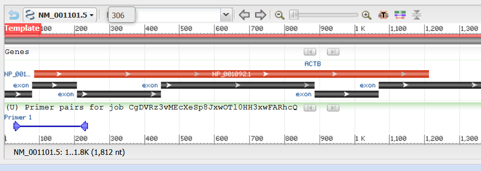

# Introduction
ACTB (Actin Beta) is a protein-coding gene that encodes the beta-actin protein, which is a key component of the cytoskeleton in eukaryotic cells. It plays a crucial role in maintaining cell shape, motility, and intracellular transport. Actin proteins are highly conserved across species and are involved in various cellular processes, including muscle contraction, cell division, and cell signaling.

ACTB is used as housekeeping gene in various cancer/immune studies. The design of it in human is somehow challenging as it is similar to POTE family member genes (less of a concern though as their expressions are <1/100 of ACTB) and ACTG1 (more of a concern, similarly abundant expressed as ACTB).

Many papers used a primer pair pulled from Harvard Primer Bank ([link](https://pga.mgh.harvard.edu/cgi-bin/primerbank/new_search2.cgi)). However, there are only 2 mismatches for each forward and reverse primer. 

This set, as used in this Nature Cancer [paper](https://www.nature.com/articles/s43018-025-00933-2), is: F:5'-CATGTACGTTGCTATCCAGGC-3' and R:5'-CTCCTTAATGTCACGCACGAT-3' (amplicon size: 250 bp). Use this set as backup if the following design fails.

# Design
1. Navigate to the NCBI record of ACTB [here](https://www.ncbi.nlm.nih.gov/gene/60). The RefSeq ID for ACTB is NM_001101.5.
2. Go to Primer Blast, input the following parameters:
   - PCR Template: NM_001101.5
   - Product Size: 80-230 bp
   - Primer Tm: 58-62 °C, Optimal 60 °C, Max Tm difference 1.5 °C
   - Exclusion: 
     - Exclude predicted Refseq transcripts.
     - Exclude uncultured/environmental samples sequences.
   - Organism: Homo sapiens (taxid:9606)
   - Primer Size: 16-24; Opt 20
   - Primer GC content: 40-60%
3. We can get one primer pair:
   
   ```
    Primer pair 1
        Sequence (5'->3')	Template strand	Length	Start	Stop	Tm	GC%	Self complementarity	Self 3' complementarity
    Forward primer	AGCACAGAGCCTCGCCTTT	Plus	19	27	45	61.89	57.89	5.00	2.00
    Reverse primer	ATCCTTCTGACCCATGCCCA	Minus	20	237	218	60.92	55.00	4.00	2.00
    Product length	211
    Products on intended targets
    >NM_001101.5 Homo sapiens actin beta (ACTB), mRNA


    product length = 211
    Forward primer  1   AGCACAGAGCCTCGCCTTT  19
    Template        27  ...................  45

    Reverse primer  1    ATCCTTCTGACCCATGCCCA  20
    Template        237  ....................  218

    Products on potentially unintended templates
    > NM_145266.6 Homo sapiens NudC domain containing 2 (NUDCD2), transcript variant 1, mRNA


    product length = 165
    Forward primer  1     AGCACAGAGCCTCGCCTTT  19
    Template        2230  ........T.T.G..T...  2212

    Reverse primer  1     ATCCTTCTGACCCATGCCCA  20
    Template        2066  G..........A...T....  2085

    > NM_001329991.2 Homo sapiens NudC domain containing 2 (NUDCD2), transcript variant 2, mRNA


    product length = 165
    Forward primer  1     AGCACAGAGCCTCGCCTTT  19
    Template        3097  ........T.T.G..T...  3079

    Reverse primer  1     ATCCTTCTGACCCATGCCCA  20
    Template        2933  G..........A...T....  2952
   ```

   For potential off-target effect from NUDCD2, it's not too much a concern here as there are several mismatches. Also, if we look at the [expression of NUDCD2](https://www.ncbi.nlm.nih.gov/gene/134492), the RPKM value is around 0.5-1, whereas ACTB has a value of ~100 in kidney. 

# Summary
The primer design is as follows:
Fwd: 5'-AGCACAGAGCCTCGCCTTT-3'
Rev: 5'-ATCCTTCTGACCCATGCCCA-3'
Amplicon size: 211bp