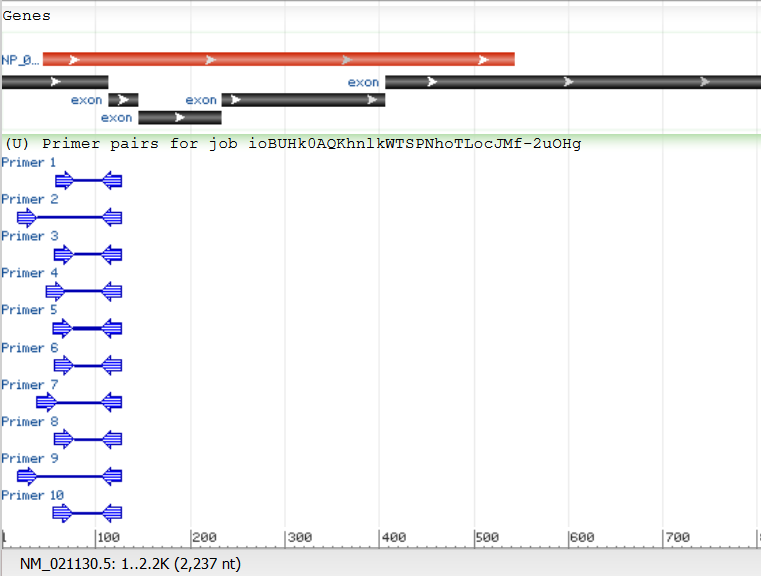

qPCR primer and probe design for PPIA.
This is based on GRCh38.p14.

# Introduction
PPIA is a housekeeping gene that is expressed in human cells. Literature can be found here [link](https://www.sciencedirect.com/science/article/pii/S0065128121001434). It is on chromosome 7.

# Primer probe design
## 1.
First search for PPIA in NCBI gene database. The result can be found [here](https://www.ncbi.nlm.nih.gov/gene/5478). 
## 2.
From the result, we can see that there are several isoforms.

The two isoforms share exons in NM_021130.5. Then, we can run a Primer Blast using "RefSeq mRNA" database on homo sapiens. It turned out that all primer pairs were located on exon 1-2. . We will use those regions for primer design. Actually, if we do not include exon 1, our primers will not be specific to PPIA.
## 3.
Download exon sequences. In the graphic view, put the cursor on the transcript NM_021130.5, and click under "Donwload FASTA:"
- NM_021130.5:
```
>ref|NM_021130.5|:1-2237 Homo sapiens peptidylprolyl isomerase A (PPIA), transcript variant 1, mRNA
GTTTTGCAGACGCCACCGCCGAGGAAAACCGTGTACTATTAGCCATGGTCAACCCCACCGTGTTCTTCGA
CATTGCCGTCGACGGCGAGCCCTTGGGCCGCGTCTCCTTTGAGCTGTTTGCAGACAAGGTCCCAAAGACA
GCAGAAAATTTTCGTGCTCTGAGCACTGGAGAGAAAGGATTTGGTTATAAGGGTTCCTGCTTTCACAGAA
TTATTCCAGGGTTTATGTGTCAGGGTGGTGACTTCACACGCCATAATGGCACTGGTGGCAAGTCCATCTA
TGGGGAGAAATTTGAAGATGAGAACTTCATCCTAAAGCATACGGGTCCTGGCATCTTGTCCATGGCAAAT
GCTGGACCCAACACAAATGGTTCCCAGTTTTTCATCTGCACTGCCAAGACTGAGTGGTTGGATGGCAAGC
ATGTGGTGTTTGGCAAAGTGAAAGAAGGCATGAATATTGTGGAGGCCATGGAGCGCTTTGGGTCCAGGAA
TGGCAAGACCAGCAAGAAGATCACCATTGCTGACTGTGGACAACTCGAATAAGTTTGACTTGTGTTTTAT
CTTAACCACCAGATCATTCCTTCTGTAGCTCAGGAGAGCACCCCTCCACCCCATTTGCTCGCAGTATCCT
AGAATCTTTGTGCTCTCGCTGCAGTTCCCTTTGGGTTCCATGTTTTCCTTGTTCCCTCCCATGCCTAGCT
GGATTGCAGAGTTAAGTTTATGATTATGAAATAAAAACTAAATAACAATTGTCCTCGTTTGAGTTAAGAG
TGTTGATGTAGGCTTTATTTTAAGCAGTAATGGGTTACTTCTGAAACATCACTTGTTTGCTTAATTCTAC
ACAGTACTTAGATTTTTTTTACTTTCCAGTCCCAGGAAGTGTCAATGTTTGTTGAGTGGAATATTGAAAA
TGTAGGCAGCAACTGGGCATGGTGGCTCACTGTCTGTAATGTATTACCTGAGGCAGAAGACCACCTGAGG
GTAGGAGTCAAGATCAGCCTGGGCAACATAGTGAGACGCTGTCTCTACAAAAAATAATTAGCCTGGCCTG
GTGGTGCATGCCTAGTCCTAGCTGATCTGGAGGCTGACGTGGGAGGATTGCTTGAGCCTAGAGTGAGCTA
TTATCATGCCACTGTACAGCCTGGGTGTTCACAGATCTTGTGTCTCAAAGGTAGGCAGAGGCAGGAAAAG
CAAGGAGCCAGAATTAAGAGGTTGGGTCAGTCTGCAGTGAGTTCATGCATTTAGAGGTGTTCTTCAAGAT
GACTAATGTCAAAAATTGAGACATCTGTTGCGGTTTTTTTTTTTTTTTTTTCCCCTGGAATGCAGTGGCG
TGATCTCAGCTCACTGCAGCCTCCGCCTCCTGGGTTCAAGTGATTCTAGTGCCTCAGCCTCCTGAGTAGC
TGGGATAATGGGCGTGTGCCACCATGCCCAGCTAATTTTTGTATTTTTAGTATAGATGGGGTTTCATCAT
TTTGACCAGGCTGGTCTCAAACTCTTGACCTCAGCTGATGCGCCTGCCTTGGCCTCCCAAACTGCTGAGA
TTACAGATGTGAGCCACCGCACCCTACCTCATTTTCTGTAACAAAGCTAAGCTTGAACACTGTTGATGTT
CTTGAGGGAAGCATATTGGGCTTTAGGCTGTAGGTCAAGTTTATACATCTTAATTATGGTGGAATTCCTA
TGTAGAGTCTAAAAAGCCAGGTACTTGGTGCTACAGTCAGTCTCCCTGCAGAGGGTTAAGGCGCAGACTA
CCTGCAGTGAGGAGGTACTGCTTGTAGCATATAGAGCCTCTCCCTAGCTTTGGTTATGGAGGCTTTGAGG
TTTTGCAAACCTGACCAATTTAAGCCATAAGATCTGGTCAAAGGGATACCCTTCCCACTAAGGACTTGGT
TTCTCAGGAAATTATATGTACAGTGCTTGCTGGCAGTTAGATGTCAGGACAATCTAAGCTGAGAAAACCC
CTTCTCTGCCCACCTTAACAGACCTCTAGGGTTCTTAACCCAGCAATCAAGTTTGCCTATCCTAGAGGTG
GCGGATTTGATCATTTGGTGTGTTGGGCAATTTTTGTTTTACTGTCTGGTTCCTTCTGCGTGAATTACCA
CCACCACCACTTGTGCATCTCAGTCTTGTGTGTTGTCTGGTTACGTATTCCCTGGGTGATACCATTCAAT
GTCTTAATGTACTTGTGGCTCAGACCTGAGTGCAAGGTGGAAATAAACATCAAACATCTTTTCATTA
```
- NM_021130.5 exons:
```
>ref|NM_021130.5|:1-113 Homo sapiens peptidylprolyl isomerase A (PPIA), transcript variant 1, mRNA
GTTTTGCAGACGCCACCGCCGAGGAAAACCGTGTACTATTAGCCATGGTCAACCCCACCGTGTTCTTCGA
CATTGCCGTCGACGGCGAGCCCTTGGGCCGCGTCTCCTTTGAG
>ref|NM_021130.5|:114-144 Homo sapiens peptidylprolyl isomerase A (PPIA), transcript variant 1, mRNA
CTGTTTGCAGACAAGGTCCCAAAGACAGCAG
>ref|NM_021130.5|:145-233 Homo sapiens peptidylprolyl isomerase A (PPIA), transcript variant 1, mRNA
AAAATTTTCGTGCTCTGAGCACTGGAGAGAAAGGATTTGGTTATAAGGGTTCCTGCTTTCACAGAATTAT
TCCAGGGTTTATGTGTCAG
>ref|NM_021130.5|:234-406 Homo sapiens peptidylprolyl isomerase A (PPIA), transcript variant 1, mRNA
GGTGGTGACTTCACACGCCATAATGGCACTGGTGGCAAGTCCATCTATGGGGAGAAATTTGAAGATGAGA
ACTTCATCCTAAAGCATACGGGTCCTGGCATCTTGTCCATGGCAAATGCTGGACCCAACACAAATGGTTC
CCAGTTTTTCATCTGCACTGCCAAGACTGAGTG
>ref|NM_021130.5|:407-2237 Homo sapiens peptidylprolyl isomerase A (PPIA), transcript variant 1, mRNA
GTTGGATGGCAAGCATGTGGTGTTTGGCAAAGTGAAAGAAGGCATGAATATTGTGGAGGCCATGGAGCGC
TTTGGGTCCAGGAATGGCAAGACCAGCAAGAAGATCACCATTGCTGACTGTGGACAACTCGAATAAGTTT
GACTTGTGTTTTATCTTAACCACCAGATCATTCCTTCTGTAGCTCAGGAGAGCACCCCTCCACCCCATTT
GCTCGCAGTATCCTAGAATCTTTGTGCTCTCGCTGCAGTTCCCTTTGGGTTCCATGTTTTCCTTGTTCCC
TCCCATGCCTAGCTGGATTGCAGAGTTAAGTTTATGATTATGAAATAAAAACTAAATAACAATTGTCCTC
GTTTGAGTTAAGAGTGTTGATGTAGGCTTTATTTTAAGCAGTAATGGGTTACTTCTGAAACATCACTTGT
TTGCTTAATTCTACACAGTACTTAGATTTTTTTTACTTTCCAGTCCCAGGAAGTGTCAATGTTTGTTGAG
TGGAATATTGAAAATGTAGGCAGCAACTGGGCATGGTGGCTCACTGTCTGTAATGTATTACCTGAGGCAG
AAGACCACCTGAGGGTAGGAGTCAAGATCAGCCTGGGCAACATAGTGAGACGCTGTCTCTACAAAAAATA
ATTAGCCTGGCCTGGTGGTGCATGCCTAGTCCTAGCTGATCTGGAGGCTGACGTGGGAGGATTGCTTGAG
CCTAGAGTGAGCTATTATCATGCCACTGTACAGCCTGGGTGTTCACAGATCTTGTGTCTCAAAGGTAGGC
AGAGGCAGGAAAAGCAAGGAGCCAGAATTAAGAGGTTGGGTCAGTCTGCAGTGAGTTCATGCATTTAGAG
GTGTTCTTCAAGATGACTAATGTCAAAAATTGAGACATCTGTTGCGGTTTTTTTTTTTTTTTTTTCCCCT
GGAATGCAGTGGCGTGATCTCAGCTCACTGCAGCCTCCGCCTCCTGGGTTCAAGTGATTCTAGTGCCTCA
GCCTCCTGAGTAGCTGGGATAATGGGCGTGTGCCACCATGCCCAGCTAATTTTTGTATTTTTAGTATAGA
TGGGGTTTCATCATTTTGACCAGGCTGGTCTCAAACTCTTGACCTCAGCTGATGCGCCTGCCTTGGCCTC
CCAAACTGCTGAGATTACAGATGTGAGCCACCGCACCCTACCTCATTTTCTGTAACAAAGCTAAGCTTGA
ACACTGTTGATGTTCTTGAGGGAAGCATATTGGGCTTTAGGCTGTAGGTCAAGTTTATACATCTTAATTA
TGGTGGAATTCCTATGTAGAGTCTAAAAAGCCAGGTACTTGGTGCTACAGTCAGTCTCCCTGCAGAGGGT
TAAGGCGCAGACTACCTGCAGTGAGGAGGTACTGCTTGTAGCATATAGAGCCTCTCCCTAGCTTTGGTTA
TGGAGGCTTTGAGGTTTTGCAAACCTGACCAATTTAAGCCATAAGATCTGGTCAAAGGGATACCCTTCCC
ACTAAGGACTTGGTTTCTCAGGAAATTATATGTACAGTGCTTGCTGGCAGTTAGATGTCAGGACAATCTA
AGCTGAGAAAACCCCTTCTCTGCCCACCTTAACAGACCTCTAGGGTTCTTAACCCAGCAATCAAGTTTGC
CTATCCTAGAGGTGGCGGATTTGATCATTTGGTGTGTTGGGCAATTTTTGTTTTACTGTCTGGTTCCTTC
TGCGTGAATTACCACCACCACCACTTGTGCATCTCAGTCTTGTGTGTTGTCTGGTTACGTATTCCCTGGG
TGATACCATTCAATGTCTTAATGTACTTGTGGCTCAGACCTGAGTGCAAGGTGGAAATAAACATCAAACA
TCTTTTCATTA
```
## 4. 
Open IDT primer quest, fill in the mRNA sequence. Under Custom Design Parameters, set design parameters for qPCR (2 Primers + Probe). Then change the parameters:
- Reuslts to return: 10
- Primer GC %: 40-60. Opt = 50
- Probe GC %: 30-80. Opt = 50
- Amplicon size: 75-200. Opt = 120
- Min Overlap on 3' end of Primer: 3
- Min overlap on 5' end of Primer: 6
- Overlap Junction List: 113, 233,406 (fill in positions according to exons)

Note that we don't change primer Tm here as IDT estimation is usually a bit higher than Primer Blast, so keeping the default should be fine.

## 5.
Click "GET ASSAYS" and we can see the results. Click **SHOW CUSTOM TARGET REGIONS** and we can see the primer overlap with the junctions:

Click "DOWNLOAD ASSAYS" and we can examine the primer-probe sets.

## 6. 
Examine the primer-probe sets. Pick one that looks ok and check the specificity using Primer-BLAST: 
- Fill in the "Primer Parameters". Paste the forward and reverse primers into "Use my own forward primer (5'->3' on plus strand)" and "Use my own reverse primer (5'->3' on minus strand)", respectively. 
- Select core_nt as the database. 
- Check "Exclude predicted Refseq transcripts (accession with XM, XR prefix)" and "Exclude uncultured/environmental sample sequences"
- Select "homo sapiens" as organism. 
- Check "show results in a new window" and "use new graphic view"
  
## 7. 
Verify that the primer probe set can amplify PPIA, and self complementarity is good. For this gene, we will still have some potential targets for other genes. One potential product is DNAJC10 mRNA. There are 5 mismatches and the product length is 341. This should be enough differences so that DNAJC10 will not interfere with PPIA amplification.
Now we have:
- Forward primer: 5'-GCGTCTCCTTTGAGCTGTTT-3'
- Reverse primer: 5'-CTGTGAAAGCAGGAACCCTTAT-3'
- Probe: 5'-CAGACAAGGTCCCAAAGACAGCAGAA-3'