# Introduction
This document is for qPCR primers of NF-kB related genes in rat.
Date: 2025-01-27

Selected genes:
- Receptors: Tnfrsf1a, Il1r1
- Cytokines: Tnf(Tnf-a), Il1B, Il6, Il10
- Transcription factors: Mki67
- Structural genes: Nfkb1
- Inhibitors: Ikk1 (Chuk)
- Apoptosis: Tp53 

General approach:
- Design primers using Primer Blast
- Check "span exons" or "intron length range" to avoid gDNA amplification
- Check hairpin/self-dimer formation with OligoAnalyzer
# Tnfrsf1a
Design primer using Primer Blast with NM_013091.2. The specs are below:

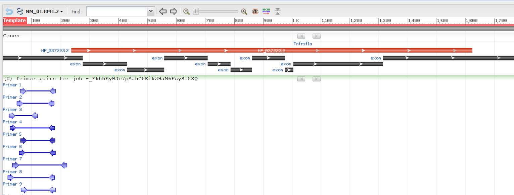
Note that this primer pair do not span exon-exon junctions, so gDNA removal is needed. 
- Forward: 5'-ACCGTACCCTGATCTCCATCT-3'
- Reverse: 5'-AATTGGCAACGCTGGTGAATG-3'

# Il1r1
Design primer using Primer Blast with NM_001412593.1. Note that there are two isoforms, so we select the regions that are common between the two. Set the forward primer to start from 312bp (the common exon).
Specs are below:

- Forward: 5'-ATGAGCCCACGGAATGAGAC-3'
- Reverse: 5'-CTGAAGGGTGTTCCAAAAACTGA-3'

# Tnf (TNF-a)
Design one using Primer Blast with NM_012675.3. The specs are below:
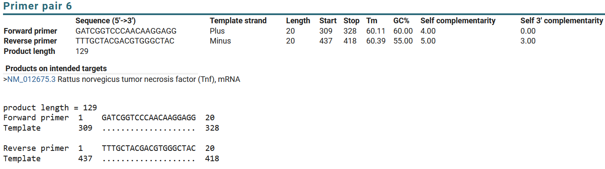

- Forward: 5'-GATCGGTCCCAACAAGGAGG-3'
- Reverse: 5'-TTTGCTACGACGTGGGCTAC-3'

# Il1b
Design one using Primer Blast with NM_031512.2. The specs are below:
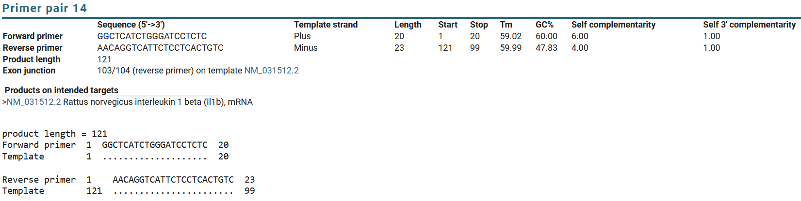

- Forward: 5'-GGCTCATCTGGGATCCTCTC-3'
- Reverse: 5'-AACAGGTCATTCTCCTCACTGTC-3'
  
# Il6
Design one using Primer Blast with NM_012589.2. The specs are below:
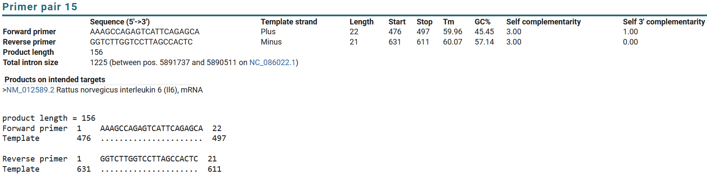
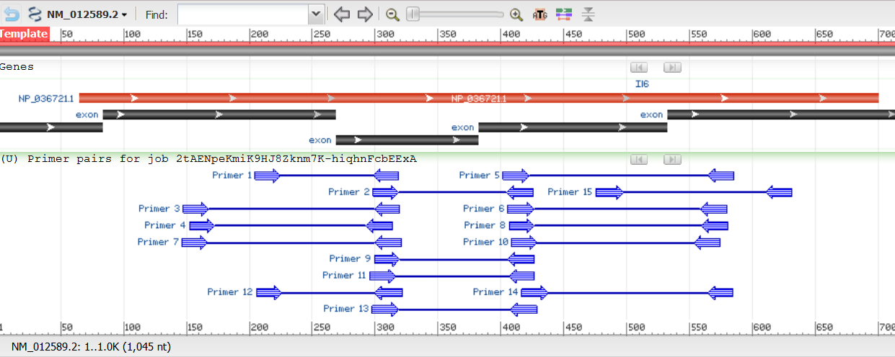
- Forward: 5'-AAAGCCAGAGTCATTCAGAGCA-3'
- Reverse: 5'-GGTCTTGGTCCTTAGCCACTC-3'

# Il10
Design primer using Primer Blast with NM_012854.2. The specs are below:
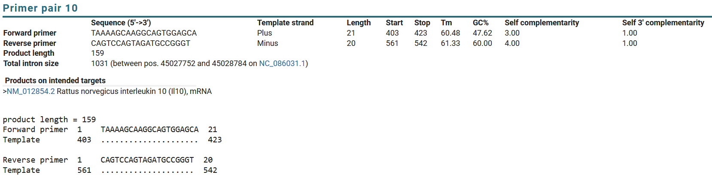
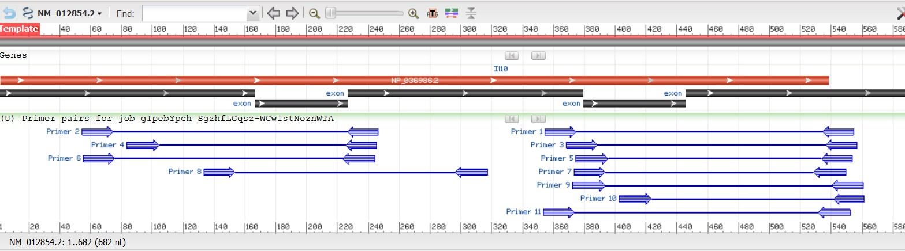
- Forward: 5'-TAAAAGCAAGGCAGTGGAGCA-3'
- Reverse: 5'-CAGTCCAGTAGATGCCGGGT-3'
  
# Mki67
Design primer using Primer Blast with NM_001271366.1. The specs are below:

- Forward: 5'-CAGTTCCGCCAATCCAACTC-3'
- Reverse: 5'-TTCTGTTGGCCTGCTTCCAT-3'

# Nfkb1
Design primer using Primer Blast with NM_001276711.2. There are two isoforms with >99% similary, make sure amplify both. The specs are below:
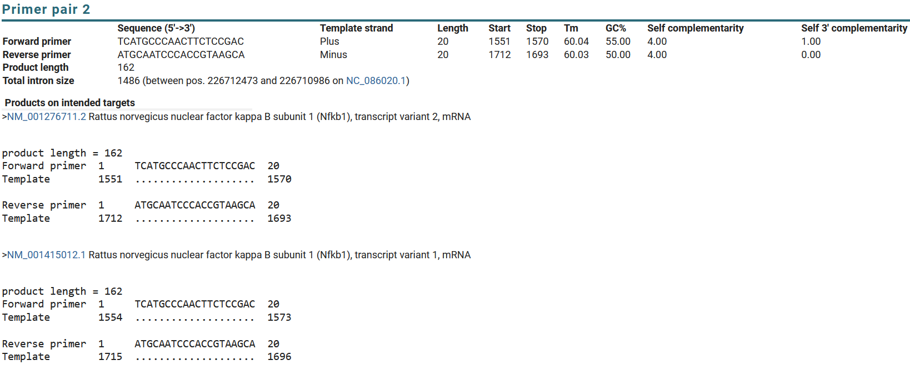
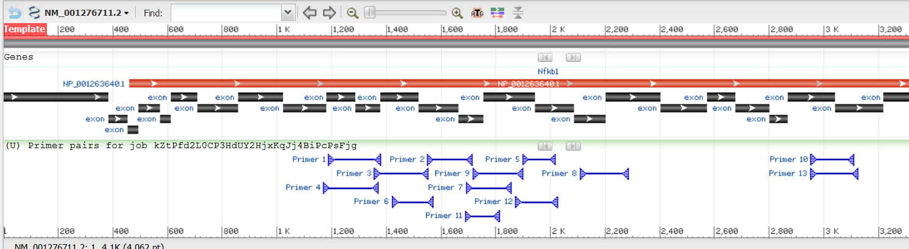
- Forward: 5'-TCATGCCCAACTTCTCCGAC-3'
- Reverse: 5'-ATGCAATCCCACCGTAAGCA-3'

# Ikk1 (Chuk)
Design primer using Primer Blast with NM_001107588.1. The specs are below:

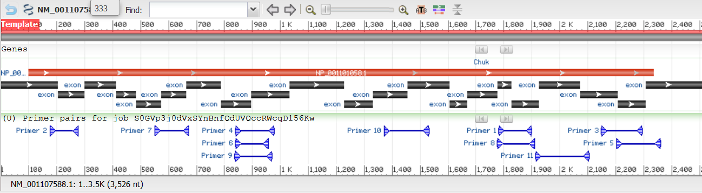
- Forward: 5'-ACAGCGTGCCATTGATCTCT-3'
- Reverse: 5'-GAACTCGGTCCTGACTCTGC-3'

# Tp53
Design primer using Primer Blast with NM_030989.3. There are several other isoforms, accept by checking all of them. We try to amplify as many isoforms as we can. The specs are below:
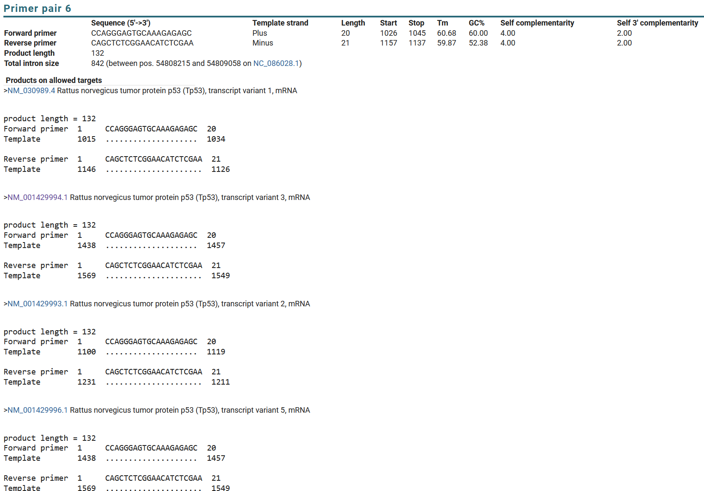
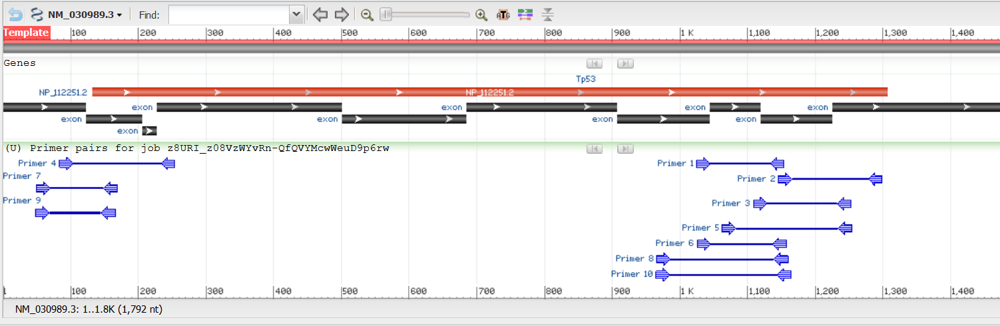
- Forward: 5'-CCAGGGAGTGCAAAGAGAGC-3'
- Reverse: 5'-CAGCTCTCGGAACATCTCGAA-3'